# Viikko 1

### Tehtävä 1
SELECT * FROM taulu WHERE kentta = 'arvo'

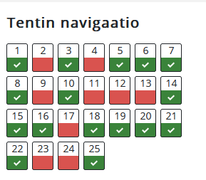

# Viikko 2

### Tehtävä 1
SELECT id, name, description, icon, target, target_minvalue, target_maxvalue, target_text FROM goal;

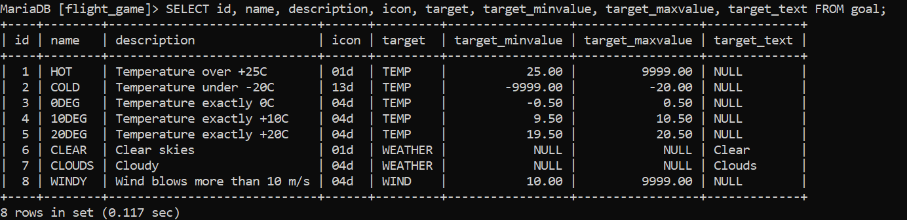

### Tehtävä 2
 SELECT name, type FROM airport WHERE iso_country = 'FI';

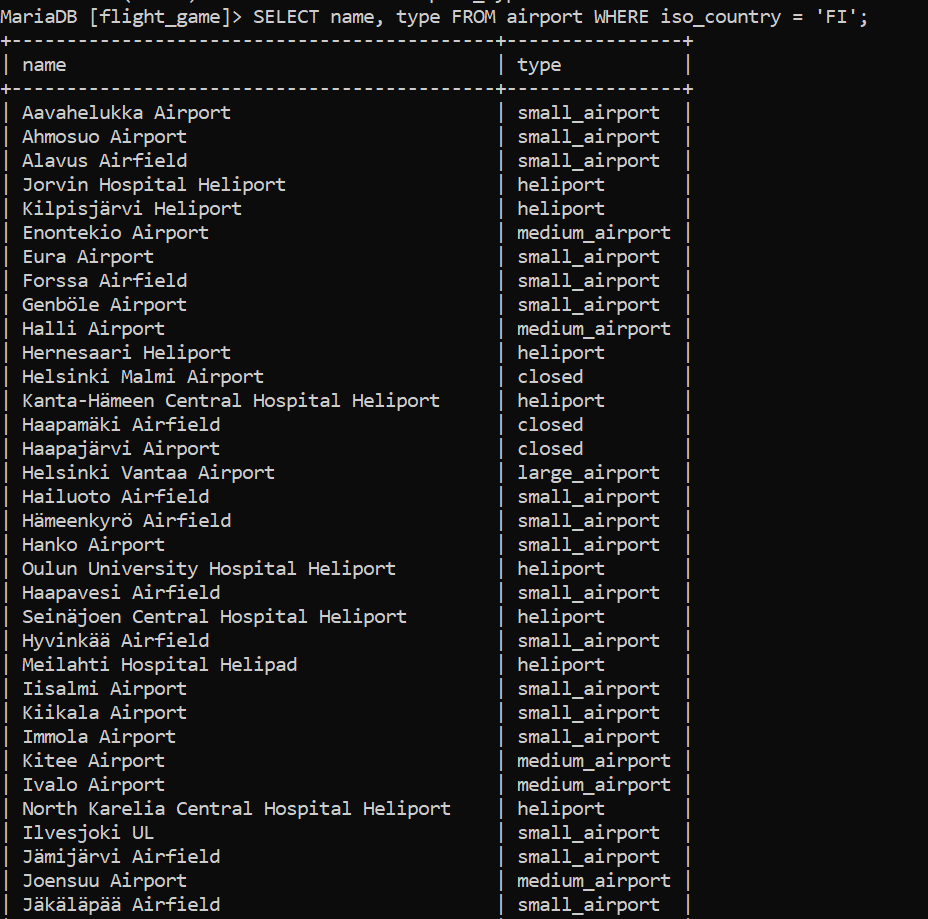

### Tehtävä 3
SELECT name FROM airport WHERE iso_country = 'FI' ORDER BY name ASC;

### Tehtävä 4
SELECT name, type FROM airport WHERE iso_country = 'FI' ORDER BY type, name;

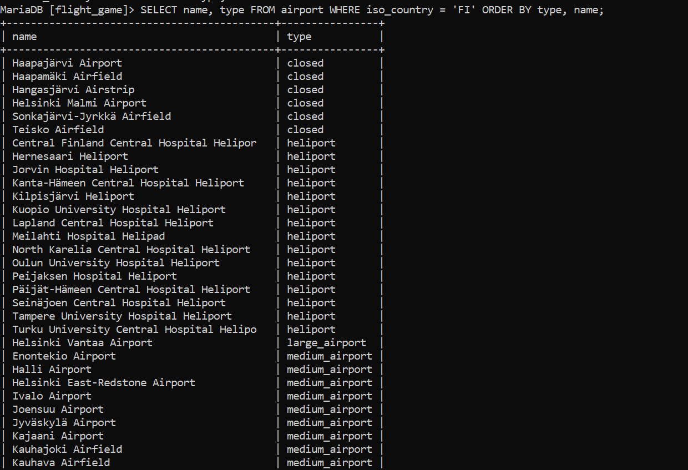

### Tehtävä 5
SELECT name FROM country WHERE name LIKE 'f%';

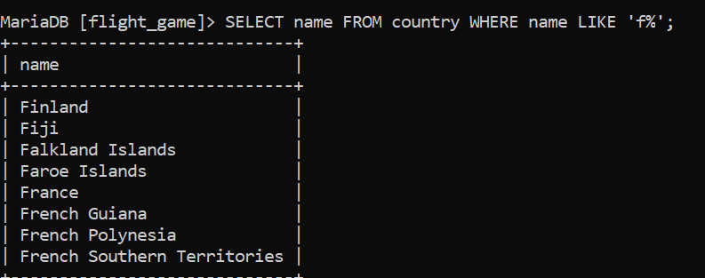

### Tehtävä 6
SELECT name FROM country WHERE name LIKE '%f%';

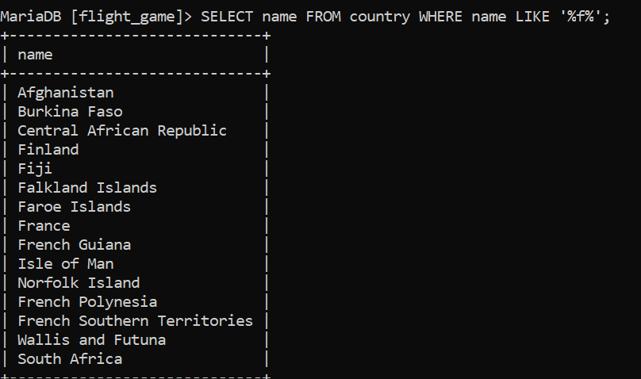

### Tehtävä 7
SELECT location FROM game WHERE screen_name = 'Vesa';

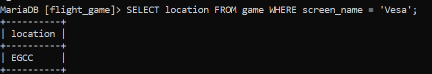

### Tehtävä 8
SELECT co2_consumed FROM game WHERE screen_name = 'Ilkka';

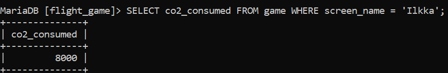

### Tehtävä 9
SELECT co2_budget FROM game LIMIT 1;

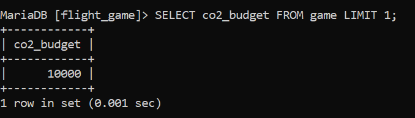

# Viikko 2
## WHERE-osan liitosehto harjoituset

### Tehtävä 1
SELECT iso_country AS "country name", name AS "airport name" FROM airport WHERE iso_country = 'IS';

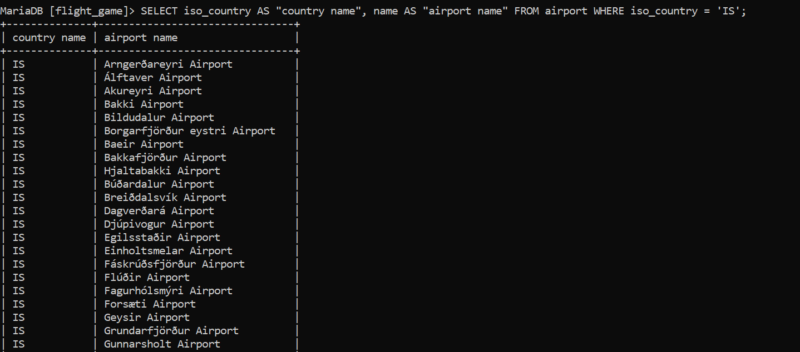

### Tehtävä 2
SELECT name AS "airport name" FROM airport WHERE iso_country = 'FR' AND type = "large_airport";

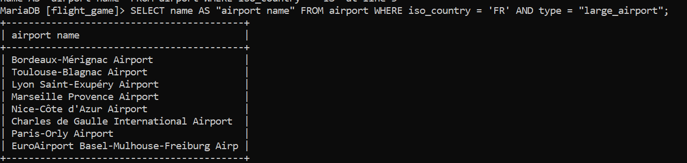

### Tehtävä 3
SELECT country.name AS "country_name", airport.name AS "airport_name" FROM airport, country
    -> WHERE country.continent like 'AN' AND airport.iso_country like country.iso_country;

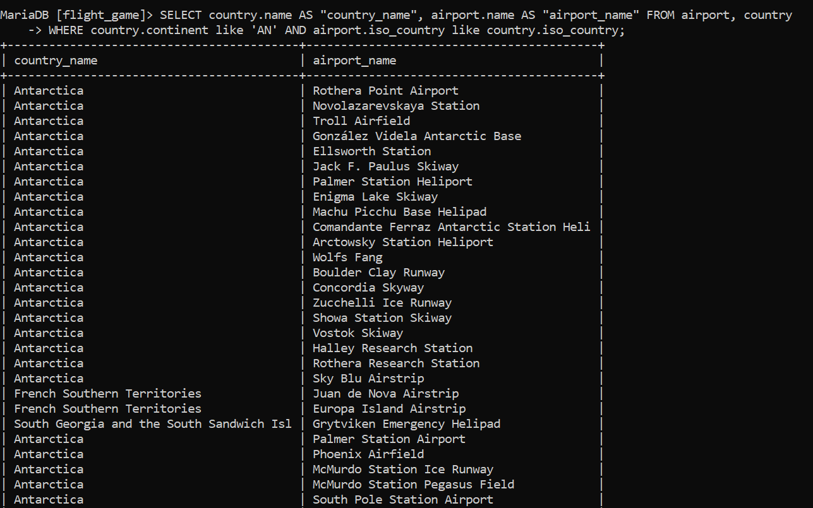

### Tehtävä 4

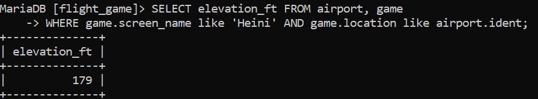

### Tehtävä 5

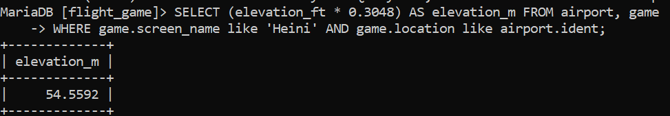

### Tehtävä 6

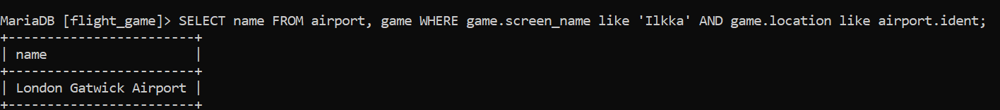

### Tehtävä 7

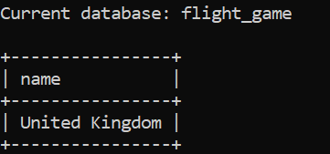

### Tehtävä 8

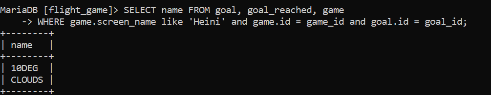

### Tehtävä 9

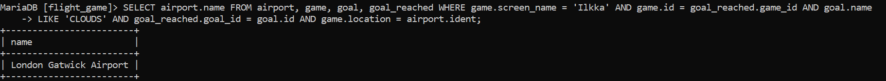

### Tehtävä 10
select country.name
     from country, goal, goal_reached, airport, game
    where game.screen_name = "Ilkka" AND goal.name = 'CLOUDS' AND game.id = goal_reached.game_id and goal_reached.goal_id = goal.id and game.location = airport.ident AND airport.iso_country = country.iso_country

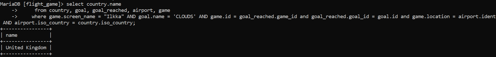

# Viikko 3

### Tehtävä 1

